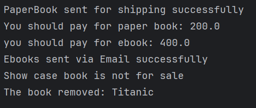

# 📚 Quantum Bookstore

Quantum Bookstore is a simple Java-based simulation of an online bookstore system. It supports managing different types of books and handles operations like buying books, removing outdated books, and displaying product information—all while following clean object-oriented design principles.

---

## 🚀 Features

- Manage inventory of books with different types:
  - 📦 **PaperBook**: Physical copy with stock tracking and shipping.
  - 💾 **EBook**: Digital copy with email delivery.
  - 🖼️ **ShowcaseBook**: Display-only books (not for sale).
- Add and remove books from the inventory.
- Purchase books using ISBN, quantity,title, email, and address.
- Extensible design allows easy addition of new book types.
  
---

## 📸 Output 
> 
